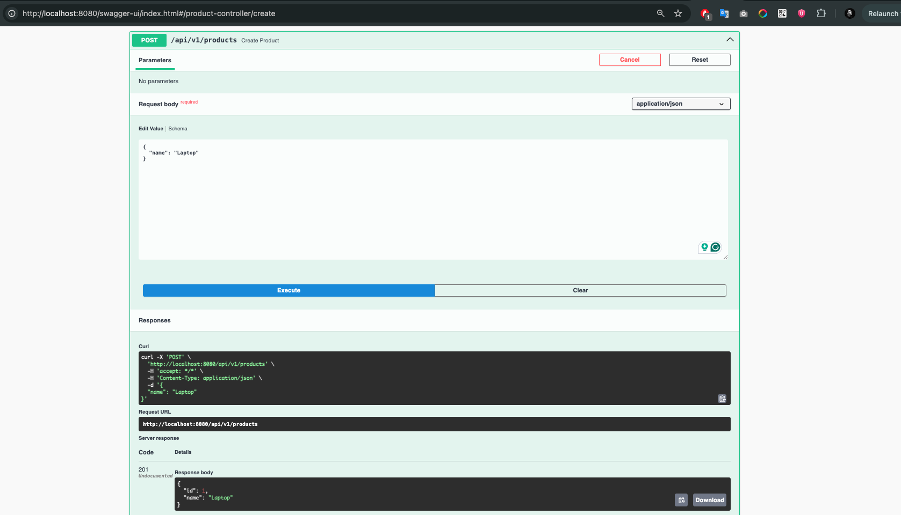
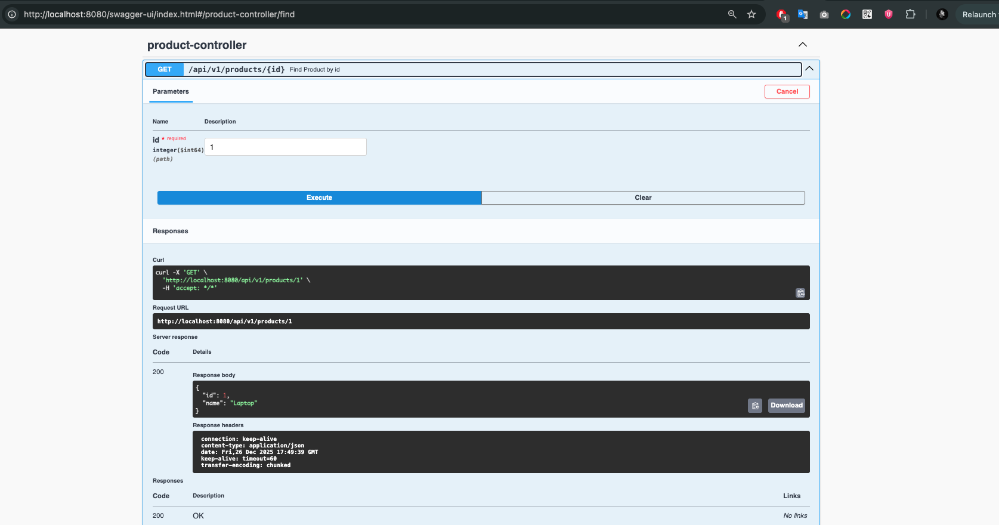
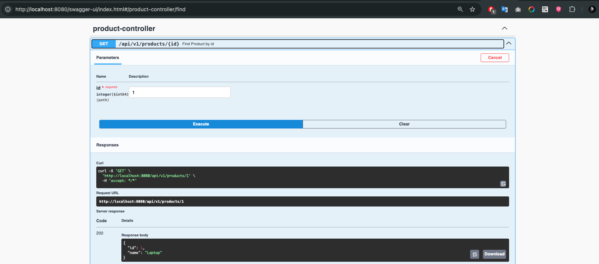
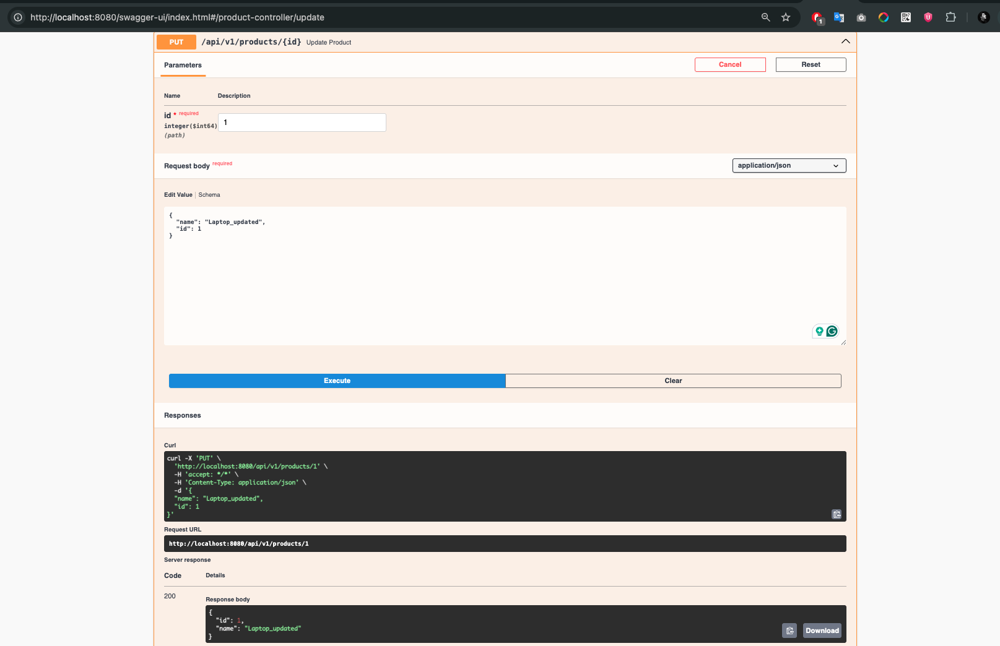
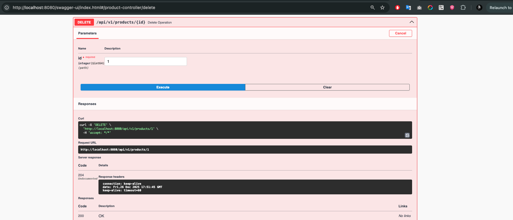
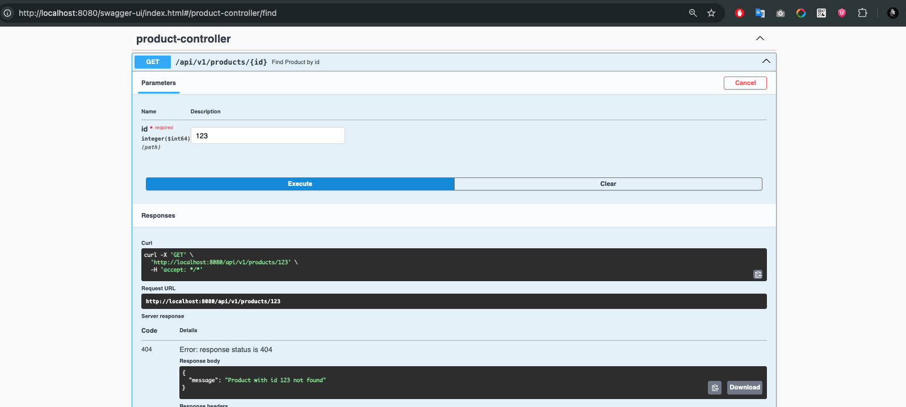
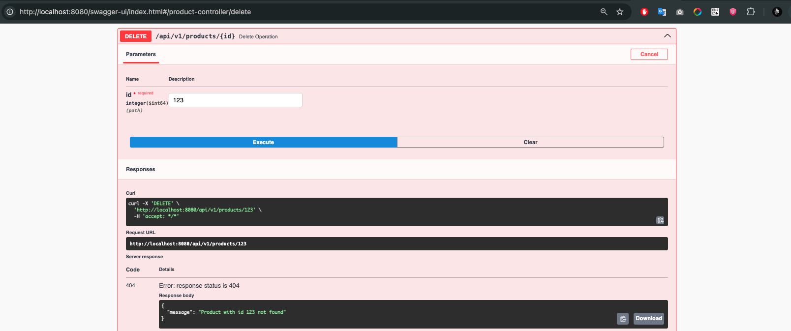

# Products API

Simple REST API for managing products, built with **Spring Boot**, **Spring Data JPA**, and **Swagger / OpenAPI**.

The project demonstrates basic CRUD operations (Create, Read, Update, Delete) and error handling.

---

## 🚀 Technologies

* Java 17+
* Spring Boot
* Spring Web
* Spring Data JPA
* Hibernate
* Swagger (OpenAPI 3)
* Maven

---

## 🔧 How to Run

1. Clone the repository:

```bash
git clone <repository-url>
```

2. Go to the project folder:

```bash
cd vistula-java-project-task-2
```

3. Run the application:

```bash
mvn spring-boot:run
```

The application will be available at:

```
http://localhost:8080
```

---

## 📖 Swagger / OpenAPI

Swagger UI:

```
http://localhost:8080/swagger-ui/index.html
```

---

## 🔗 API Examples (curl)

### ➕ Create Product

**POST** `/api/v1/products`

```bash
curl -X POST http://localhost:8080/api/v1/products \
  -H "Content-Type: application/json" \
  -d '{
    "name": "Laptop"
  }'
```


---

### 🔍 Get Product by ID

**GET** `/api/v1/products/{id}`

```bash
curl http://localhost:8080/api/v1/products/1
```


---

### 📋 Get All Products

**GET** `/api/v1/products`

```bash
curl http://localhost:8080/api/v1/products
```


---

### ✏️ Update Product

**PUT** `/api/v1/products/{id}`

```bash
curl -X PUT http://localhost:8080/api/v1/products/1 \
  -H "Content-Type: application/json" \
  -d '{
    "id": 1,
    "name": "Updated Laptop"
  }'
```



---

### ❌ Delete Product

**DELETE** `/api/v1/products/{id}`

```bash
curl -X DELETE http://localhost:8080/api/v1/products/1
```


---

## ⚠️ Error Handling

If a product is not found, the API returns:

* **HTTP 404 NOT FOUND**

```json
{
  "message": "Product with id X not found"
}
```




Errors are handled globally using `@ControllerAdvice`.

---

## 🧠 Architecture

* **Controller** — REST endpoints
* **Service** — business logic
* **Repository** — database access (JPA)
* **Mapper** — Entity ↔ DTO mapping
* **Exception layer** — centralized error handling

---
